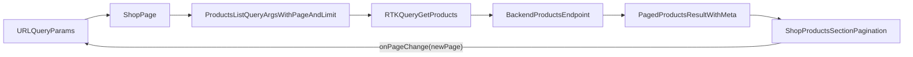

# Shop Pagination Navigation Plan

## Goal
Enable reliable page navigation on the shop page so moving to page 2+ fetches the correct next 20 products, while preserving filters/sort and syncing page state in URL params.

## Confirmed Scope
- Enhance existing pagination (not a full redesign).
- Keep filters/sort/search behavior intact across page changes.
- Sync current page to URL query params.
- Add backend pagination metadata to support accurate page controls.

## Relevant References
- Frontend shop page orchestration: `/Users/rotem.lahav/projects/first-skills-project/apps/front/src/app/shop/ShopPage.tsx`
- URL/query mapping: `/Users/rotem.lahav/projects/first-skills-project/apps/front/src/app/shop/shopSearchParams.ts`
- Pagination UI section: `/Users/rotem.lahav/projects/first-skills-project/apps/front/src/app/shop/sections/ShopProductsSection.tsx`
- Frontend RTK query endpoint: `/Users/rotem.lahav/projects/first-skills-project/apps/front/src/redux/productsApi/productsApi.ts`
- Backend query parsing: `/Users/rotem.lahav/projects/first-skills-project/apps/backend/src/app/products/dto/parse-product-list-query.ts`
- Backend query builder: `/Users/rotem.lahav/projects/first-skills-project/apps/backend/src/app/products/services/products-list-query-builder.service.ts`
- Shared contracts: `/Users/rotem.lahav/projects/first-skills-project/libs/shared/products-contracts/src/lib/products-contracts.ts`

## Standards To Apply
- `frontend/redux-rtk-query-api-standard`
- `global/shared-code-in-libs`
- `global/keep-tsx-clean-from-logic`

## Execution Flow

## Tasks

### Task 1: Save Spec Documentation
Create `agent-os/specs/2026-05-06-1156-shop-pagination-navigation/` with:
- `plan.md` (full execution plan)
- `shape.md` (scope + decisions)
- `standards.md` (full standard content)
- `references.md` (files/patterns reviewed)
- `visuals/` (empty; no visuals provided)

### Task 2: Define/Align Shared Pagination Contract
- Add or extend shared response contract in `libs/shared/products-contracts` for paginated list metadata (`items`, `total`, `page`, `limit`, `totalPages`).
- Keep query args contract aligned with existing `page`/`limit` semantics.
- Ensure exports are available to both backend and frontend.

### Task 3: Implement Backend Paginated Response
- Update backend products service/controller flow to return metadata + items rather than plain list.
- Compute `total` and derive `totalPages` consistently with active filters.
- Keep existing pagination defaults and guardrails (`page=1`, `limit=20`, max limit cap).

### Task 4: Wire Frontend URL/Page Query Integration
- Update shop search param parsing to read `page`/`limit` from URL.
- Update URL writing to include current page and preserve filters/sort.
- Define reset rule: when filters/sort change, reset `page` to `1`; when only page changes, keep current filters/sort unchanged.

### Task 5: Wire Pagination UI Controls To State
- Replace static pagination buttons with controlled behavior using page metadata from API.
- Drive interactions via named handlers and URL updates (not inline multi-step JSX logic).
- Ensure page control actions trigger RTK Query refetch through changed args.

### Task 6: Add/Update Tests
- Backend: verify metadata correctness (`total`, `totalPages`, page slicing).
- Frontend: verify URL <-> query arg mapping and page reset-on-filter-change behavior.
- Update any affected contract/parser tests.

## Acceptance Criteria
- Navigating to page 2 requests products with `page=2` and `limit=20`.
- Correct next 20 products are shown.
- Filters/sort persist when page changes.
- URL reflects active page and supports refresh/share.
- Backend response includes pagination metadata used by frontend page controls.
- Updated tests cover critical pagination behavior end-to-end at unit/service level.
